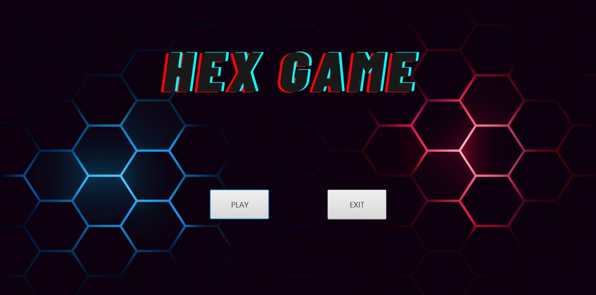

# HexGame



## 📖 Description

**HexGame** is a two-player Hex strategy game developed using JavaFX. Players compete on a hexagonal board of their chosen size, aiming to connect their respective sides to win. The objective of the game is to reach the opposite side of the board using your colored pieces.

## 📋 Table of Contents

- [📖 Description](#📖-description)
- [✨ Features](#✨-features)
- [🛠 Installation](#🛠-installation)
  - [Prerequisites](#prerequisites)
  - [Steps](#steps)
- [🎮 Usage](#🎮-usage)
- [🤝 Contributing](#🤝-contributing)
- [📄 License](#📄-license)
- [📧 Contact](#📧-contact)
- [📸 Screenshots](#📸-screenshots)

## ✨ Features

- **User-Friendly Interface:** A modern and interactive user interface developed with JavaFX.
- **Customizable Board Size:** Choose between 5x5, 11x11, and 17x17 board sizes for varying difficulty levels.
- **Player Names:** Enter names for both players to personalize the gaming experience.
- **Real-Time Game Status:** View players' moves in real-time and track the game progress.
- **Win Detection:** Automatic detection and notification of the winning player at the end of the game.
- **Navigation Options:** Options to return to the main menu or exit the game.

## 🛠 Installation

### Prerequisites

- **Java JDK 11 or Higher:** [Download Java](https://www.oracle.com/java/technologies/javase-jdk11-downloads.html)
- **Maven (Optional):** If you prefer managing the project with Maven.

### Steps

1. **Clone the Repository:**

    ```bash
    git clone https://github.com/your-username/HexGame.git
    ```

2. **Navigate to the Project Directory:**

    ```bash
    cd HexGame
    ```

3. **Build and Run the Project:**

    If you are using Maven:

    ```bash
    mvn clean install
    mvn javafx:run
    ```

    Alternatively, to compile and run directly using Java:

    ```bash
    javac -d bin src/main/java/gamepractice/HexGameProject/*.java
    java -cp bin gamepractice.HexGameProject.HelloApplication
    ```

## 🎮 Usage

1. **Start the Game:**
   - Click on the "PLAY" button in the main menu.

2. **Configure Settings:**
   - **PLAYER 1 and PLAYER 2:** Enter names for both players.
   - **MAP SIZE:** Select the desired board size (5, 11, or 17).

3. **Begin the Game:**
   - Click the "START" button to begin the game.

4. **Play the Game:**
   - Players take turns making their moves.
   - The game automatically detects and announces the winner at the end.

5. **Return to Menu or Exit:**
   - Click the "MENU" button to return to the main menu or the "EXIT" button to quit the game.

## 🤝 Contributing

Contributions are welcome! Please follow these steps to contribute to the project:

1. **Fork the Repository:** Fork the project to your GitHub account.

2. **Create a Branch:** Create a new branch for your feature or bugfix (e.g., `feature/your-feature-name`).

3. **Make Changes:** Implement your changes and commit them with clear messages.

4. **Submit a Pull Request:** Push your changes to your forked repository and open a pull request to the main repository.

Please ensure your contributions adhere to the project's coding standards and include appropriate documentation.

## 📸 Screenshots


*Main Menu Screen*


*Game Screen*
